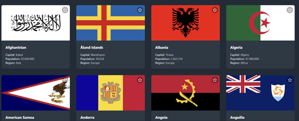
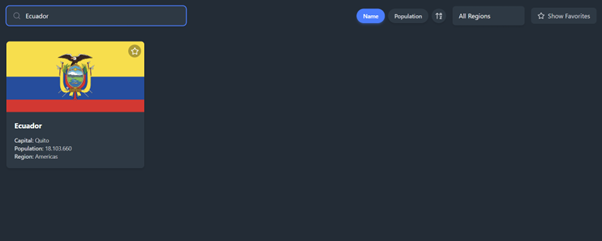
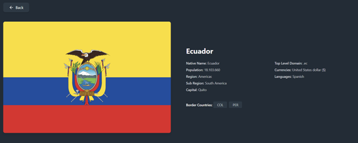
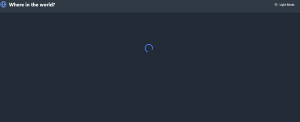
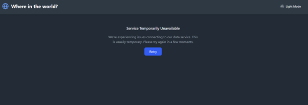
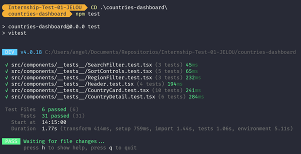
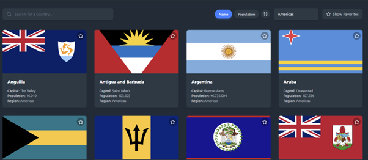
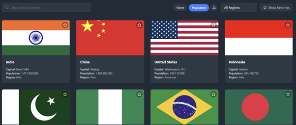
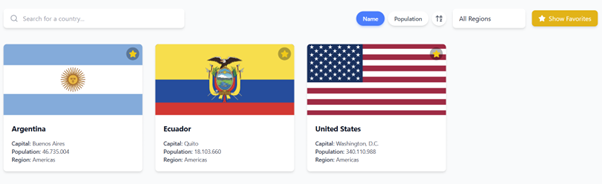
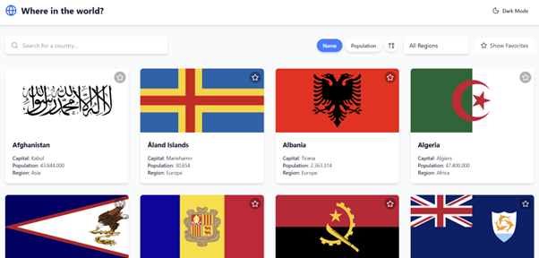

# Countries Dashboard
## Candidate Information

- **Name:** Angelo Saul Zurita Guerrero
- **Email:** aszurita@espol.edu.ec
- **Date:** 16/02/2026

---

## Project Links

| Link Type | URL |
|-----------|-----|
| GitHub Repository | https://github.com/aszurita/Internship-Test-01-JELOU |
| Loom Video | https://www.loom.com/share/bb151aeae9944f67be57d1da6218ddcf|
| Live Demo  | https://countriesdashboard.vercel.app/ |

---

## Setup Instructions

```bash
# Clone the repository
git clone https://github.com/aszurita/Internship-Test-01-JELOU 
cd Internship-Test-01-JELOU
cd countries-dashboard

# Install dependencies
npm install

# Run the development server
npm run dev

# Open in browser
http://localhost:5173 (Vite) 
```

---

## Technologies Used

- ✅ React (version: 19.2.0)
- ✅ Vite 8.0.0-beta.13
- ✅ Tailwind CSS 4.1.18
- ✅ Other libraries: Lucide React (icons), Vitest + React Testing Library (testing)

---

## Features Implemented

### Core Features

| Feature | Status | Notes |
|---------|--------|-------|
| Country List Display | ✅ / ⏳ / ❌ | ✅ |
| Search Functionality | ✅ / ⏳ / ❌ | ✅ |
| Region Filter | ✅ / ⏳ / ❌ | ✅ |
| Country Detail View | ✅ / ⏳ / ❌ | ✅ |
| Loading States | ✅ / ⏳ / ❌ | ✅ |
| Error Handling | ✅ / ⏳ / ❌ | ✅ |

### Bonus Features

| Feature | Status | Notes |
|---------|--------|-------|
| Responsive Design | ✅ / ❌ | ✅|
| Dark/Light Mode | ✅ / ❌ | ✅ | 
| Sort Functionality | ✅ / ❌ | ✅|
| Favorites (localStorage) | ✅ / ❌ | ✅ |
| TypeScript | ✅ / ❌ | ✅ |
| Unit Tests | ✅ / ❌ | ✅ |
| Live Deployment | ✅ / ❌ | ✅ |

---

## Screenshots

### Home Page / Country List

> Main dashboard displaying country cards in a grid layout with flags, names, capitals, population, and region info. Each card includes a favorite star icon.

### Search in Action

> Real-time search filtering countries by name. Searching "Ecuador" instantly displays only the matching country card.

### Country Detail View

> Detailed view of a selected country (Ecuador) showing its flag, native name, population, region, sub-region, capital, top-level domain, currencies, languages, and border countries.

### Loading

> Loading state with a spinning indicator displayed while fetching data from the REST Countries API.

### Error States

> User-friendly error message ("Service Temporarily Unavailable") shown when the API fails, with a Retry button to attempt reconnection.

### Unit Test

> Terminal output showing all 31 unit tests passing across 6 test files using Vitest and React Testing Library.

###  Region Filter

> Dropdown filter selecting "Americas" region, displaying only countries from that continent.

###  Sort
#### By Name

> Countries sorted alphabetically by name in ascending order (Afghanistan, Aland Islands, Albania, Algeria...).

#### By Population

> Countries sorted by population in descending order (India, China, United States, Indonesia...).

###  Favorites

> Favorites feature toggled on, showing only countries marked as favorites (Argentina, Ecuador, United States) persisted via localStorage.

###  DarkMode - LightMode

> Light mode theme with a clean white background and a toggle button to switch between dark and light modes.

---

## Project Structure

```
src/
├── assets/
│   └── react.svg
├── components/
│   ├── __tests__/
│   │   ├── CountryCard.test.tsx
│   │   ├── CountryDetail.test.tsx
│   │   ├── Header.test.tsx
│   │   ├── RegionFilter.test.tsx
│   │   ├── SearchFilter.test.tsx
│   │   └── SortControls.test.tsx
│   ├── filters/
│   │   ├── RegionFilter.tsx
│   │   └── SearchFilter.tsx
│   ├── sorts/
│   │   └── SortControls.tsx
│   ├── CountryCard.tsx
│   ├── CountryDetail.tsx
│   ├── CountryList.tsx
│   └── Header.tsx
├── context/
│   ├── FavoritesContext.tsx
│   └── ThemeContext.tsx
├── hooks/
│   ├── types.ts
│   ├── useCountries.ts
│   ├── useLocalStorage.ts
│   └── useTheme.ts
├── test/
│   └── setup.ts
├── App.css
├── App.tsx
├── index.css
└── main.jsx
```

---

## Challenges Faced

### Challenge 1: Sharing State Across Components Without Prop Drilling
**Problem:** Features like dark/light mode and favorites needed to be accessible across many components. Passing these values down through props at every level would lead to repetitive, hard-to-maintain code and excessive prop drilling.

**Solution:** I opted for React Context API by creating `ThemeContext` and `FavoritesContext`. This allowed any component in the tree to access and update the theme or favorites state directly, keeping the code clean and avoiding unnecessary prop chains.

### Challenge 2: Implementing Unit Tests for Components
**Problem:** I had limited prior experience with component testing. Figuring out how to properly test each component simulating user interactions, mocking API responses, and validating rendered output was a significant learning curve.

**Solution:** I researched documentation for Vitest and React Testing Library, exploring best practices and examples. Through investigation and experimentation, I was able to write 31 tests across 6 test files, covering the majority of possible cases for each component and validating their expected behavior.

---

## What I Learned

- How to create and manage React Context for sharing global state (theme, favorites) across the component tree without prop drilling.
- Writing unit tests with Vitest and React Testing Library, including simulating user interactions and mocking API calls.
- Putting `useMemo` and `useCallback` into practice for performance optimization — I previously only understood them theoretically, and this project gave me hands-on experience applying them effectively.

---

## If I Had More Time

- Interactive map integration (e.g., Leaflet or Mapbox) in the Country Detail View, using the latitude and longitude data from the API to visually locate the country and display its neighboring borders on the map.
- Country comparison tool — a side-by-side view to compare two or more countries by population, area, languages, currencies, and other key metrics.
- Real-time data visualizations with charts showing population distribution by region, top 10 most populated countries, or area comparisons.
- End-to-end testing to complement the existing unit tests and cover full user flows.

---

## Self-Assessment

On a scale of 1-5, how would you rate your submission in each area?

| Area | Rating (1-5) | Comments |
|------|--------------|----------|
| Functionality | 5 | All features are fully implemented with clear, validated functions covering both core and bonus requirements. |
| Code Quality | 4 | I followed good programming practices throughout the project. There may be opportunities to refactor and optimize further, but the codebase is clean and well-structured. |
| UI/UX | 5 | Interactive and easy-to-use dashboard with a thoughtful design  meaningful colors for each action, intuitive navigation, and a responsive layout. |
| Documentation | 4 | I don't have much prior experience with documentation, but I tried to complete each section with detail. There may be specific details I missed, which I can improve over time as I gain more experience writing documentation. |

---
